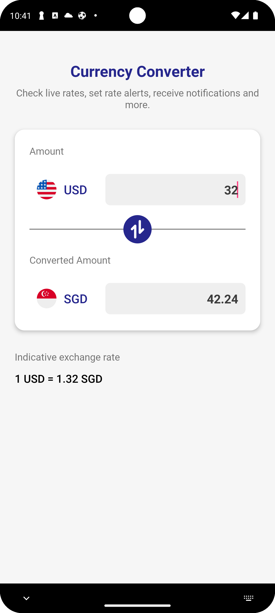
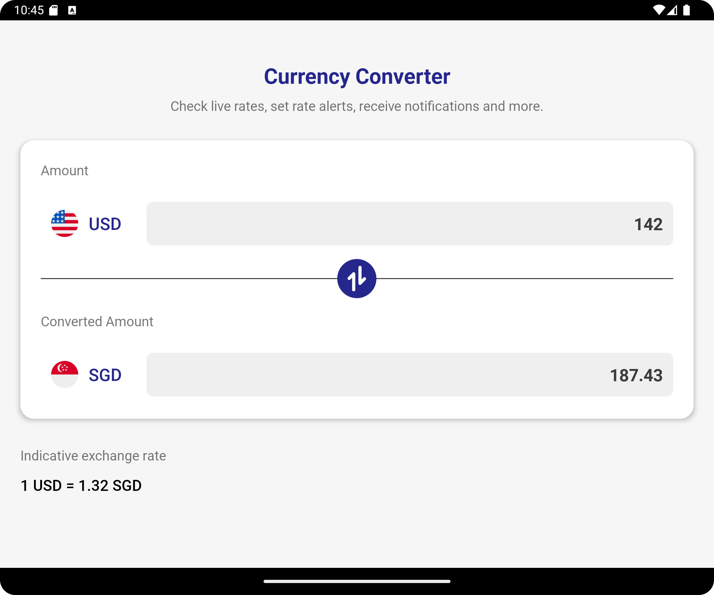

# Currency Converter

- [App Overall](#app-overall)
- [Technical Architecture](#technical-architecture)
- [Compile Steps](#compile-steps)
- [Challenges](#challenges)
- [License](#license)
---
## App Overall
Currency Converter is a mobile application that provides users to have a tool to convert value between currencies, as well as seeing the exchange rate of the 2 selected currencies.

*Currency Converter on Mobile Phone*




*Currency Converter on Tablet*



How to use?

1. Select Currencies: Choose "from currency" and "to currency" from the drop-down lists.
2. Enter Amount: Input a positive decimal value (e.g., 1, 2, 0.5).
3. Convert: Tap the central blue button to convert and display the result.
4. View Exchange Rate: The app will also display the current exchange rate between the selected currencies.

**Please note that any changes regarding the currency codes, whether it is the source currency or the destination currency, the indicated value inside each text field will be erased.**

## Technical Architecture

The app main utilized architecture will be MVVM (Model-View-ViewModel):
- Model: Hold the app's Core Logic and handles data operations
- ViewModel: Manages data for UI and coordinates between Model and View
- View: Observes changes from ViewModel and update UI accordingly

```
├── AndroidManifest.xml
├── ic_launcher-playstore.png
├── java
│   └── com
│       └── phuongtai
│           └── myconverter
│               ├── App.kt
│               ├── Constants.kt
│               ├── currency_data
│               │   └── CurrencyData.kt
│               ├── data
│               │   ├── DataRepository.kt
│               │   ├── DataRepositorySource.kt
│               │   ├── Resource.kt
│               │   ├── dto
│               │   │   ├── ExchangeRateResponse.kt
│               │   │   └── ExchangeRates.kt
│               │   ├── error
│               │   │   ├── AppError.kt
│               │   │   └── mapper
│               │   │       ├── ErrorMapper.kt
│               │   │       └── ErrorMapperSource.kt
│               │   └── remote
│               │       └── remote
│               │           ├── RemoteData.kt
│               │           ├── RemoteDataSource.kt
│               │           ├── ServiceGenerator.kt
│               │           └── service
│               │               └── ExchangeRateService.kt
│               ├── di
│               │   ├── AppModule.kt
│               │   ├── DataModule.kt
│               │   └── ErrorModule.kt
│               ├── errors
│               │   ├── ErrorManager.kt
│               │   └── ErrorUseCase.kt
│               ├── pages
│               │   ├── base
│               │   │   ├── BaseActivity.kt
│               │   │   └── BaseViewModel.kt
│               │   └── ui
│               │       ├── home
│               │       │   ├── HomeActivity.kt
│               │       │   ├── HomeViewModel.kt
│               │       │   └── adapter
│               │       │       └── CurrenciesAdapter.kt
│               │       └── splash
│               │           └── SplashActivity.kt
│               └── utils
│                   ├── LifeCycleExt.kt
│                   ├── Network.kt
│                   ├── SingleContent.kt
│                   ├── TypeExt.kt
│                   └── VIewExt.kt
└── res
    ├── drawable
    │   ├── convert_button_custom_background.xml
    │   ├── converter_custom_background.xml
    │   ├── edit_text_custom_background.xml
    │   ├── ic_australia.xml
    │   ├── ic_china.xml
    │   ├── ic_convert.xml
    │   ├── ic_launcher_background.xml
    │   ├── ic_launcher_foreground.xml
    │   ├── ic_money_exchange.xml
    │   ├── ic_singapore.xml
    │   ├── ic_us.xml
    │   └── ic_vietnam.xml
    ├── font
    │   ├── font.xml
    │   ├── roboto_black.ttf
    │   ├── roboto_black_italic.ttf
    │   ├── roboto_bold.ttf
    │   ├── roboto_bold_italic.ttf
    │   ├── roboto_italic.ttf
    │   ├── roboto_light.ttf
    │   ├── roboto_light_italic.ttf
    │   ├── roboto_medium.ttf
    │   ├── roboto_medium_italic.ttf
    │   ├── roboto_regular.ttf
    │   ├── roboto_thin.ttf
    │   └── roboto_thin_italic.ttf
    ├── layout
    │   ├── activity_home.xml
    │   ├── activity_splash.xml
    │   ├── country_currency_spinner_item.xml
    │   └── currency_converter_layout.xml
    ├── mipmap-anydpi-v26
    │   ├── ic_launcher.xml
    │   └── ic_launcher_round.xml
    ├── mipmap-hdpi
    │   ├── ic_launcher.webp
    │   └── ic_launcher_round.webp
    ├── mipmap-mdpi
    │   ├── ic_launcher.webp
    │   └── ic_launcher_round.webp
    ├── mipmap-xhdpi
    │   ├── ic_launcher.webp
    │   └── ic_launcher_round.webp
    ├── mipmap-xxhdpi
    │   ├── ic_launcher.webp
    │   └── ic_launcher_round.webp
    ├── mipmap-xxxhdpi
    │   ├── ic_launcher.webp
    │   └── ic_launcher_round.webp
    ├── values
    │   ├── colors.xml
    │   ├── dimens.xml
    │   ├── ic_launcher_background.xml
    │   ├── strings.xml
    │   └── themes.xml
    ├── values-night
    │   └── themes.xml
    └── xml
        ├── backup_rules.xml
        └── data_extraction_rules.xml
```

Folder Structure:
- **data**: Data repository management and data source alocation, only remote data source for the current project
- **utils**: Extensions, and helper functions
- **pages**: folder for all of the screens, base subfolder for the base version of ViewModel and Activity, ui subfolder for different app pages
- **di**: Dependencies injection management, utilizing Hilt

Dependencies:
- Dependencies Injection: Hilt
- Network: Retrofit
- JSON Mapper: Moshi
- Asynchronous Programming: Kotlin Coroutines
- Unit Testing: mockk, mockito

CI Pipeline:
- For now our app has a ci workflow on gh-actions branch, the main goal of this workflow is to run [unit testing](./app/src/test/java/com/phuongtai/myconverter/pages/ui/home/HomeViewModelTest.kt) and building an APK file to release on Github Release


## Compile Steps

To use this app, there are 2 options will be provided:
- Download a precompiled APK on my [Github Actions Release](https://github.com/phuongtai2003/currency-converter-app/releases)
- Manual Installation

#### Manual Installation Guide
1. Create a local.properties file if not already presented, the file has to be in the same level as the **app** folder
2. Get yourself a freecurrencyapi API Key, or obtain from [my personal sheets](https://docs.google.com/spreadsheets/d/1c9T6S-k6fbGFw7VHqc40IaScVb4qE6oE1-LGmMUiv2w/edit?usp=sharing)
3. Add a line inside local.properties file with the following syntax EXCHANGE_RATE_API_KEY=`YOUR-API-KEY`
4. Sync Gradle project
5. Run the build process by ``./gradlew assembleDebug``
6. Run the app by Android Studio

## Challenges

- **Handling API Free Limit Rate**: Currently, the API Rate is capped at 2000, my current usage has reached 1000. It takes more effort for me to carefully running debug so that it can not expands over the limit. 

## License
All Rights Reserved © 2024 Nguyen Phuong Tai

**Currency Converter**

Permission is NOT granted to any person or organization to use, copy, modify, merge, publish, distribute, sublicense, and/or sell copies of this software, unless explicit written permission is provided by the author.

This software is provided "as-is," without any warranty of any kind, express or implied, including but not limited to the warranties of merchantability, fitness for a particular purpose, and non-infringement. In no event shall the authors be liable for any claim, damages, or other liability, whether in an action of contract, tort, or otherwise, arising from, out of, or in connection with the software or the use or other dealings in the software.
